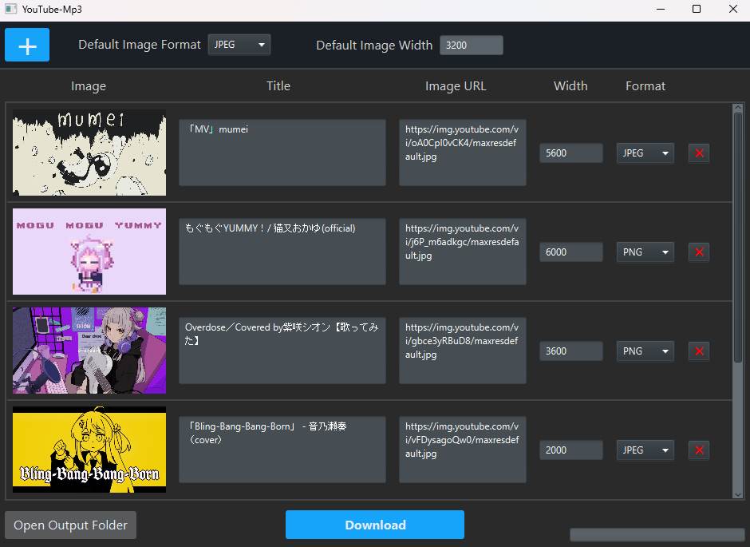

# YouTube-Mp3-UI

[**YouTube-Mp3-UI**](https://github.com/PyroWilDx/YouTube-Mp3-UI/) is a graphical interface for [YouTube-Mp3](https://github.com/PyroWilDx/YouTube-Mp3/) that converts YouTube videos into audio files while embedding a high-quality thumbnail (achieved through image upscaling).

## Download

> [!IMPORTANT]
> - Required &ndash; [Java JDK 23](https://download.oracle.com/java/23/latest/jdk-23_windows-x64_bin.exe).

|  |
|---|

## Development Set-Up

|  |  |  |
|---|---|---|

### How To Use

- Run w/ IntelliJ IDEA.

---

  Copyright &#169; 2025 PyroWilDx. All Rights Reserved.

