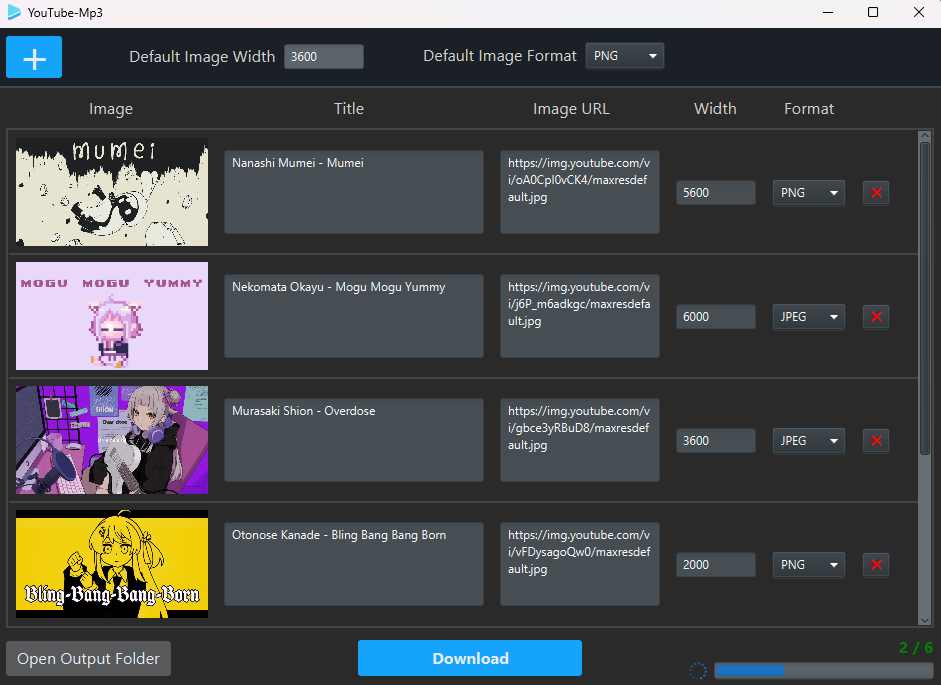

A graphical interface for [YouTube-Mp3](https://github.com/PyroWilDx/YouTube-Mp3/) that converts YouTube videos into audio files while embedding a high-quality thumbnail (achieved through image upscaling).

## 📥 Download

---

  Copyright &#169; 2025 PyroWilDx. All Rights Reserved.

